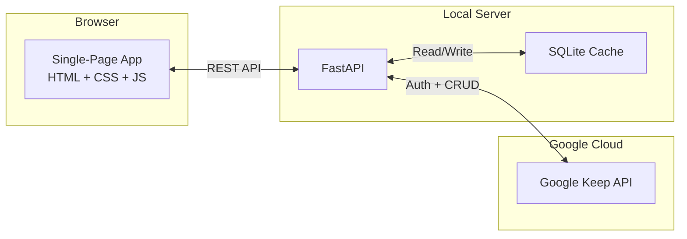
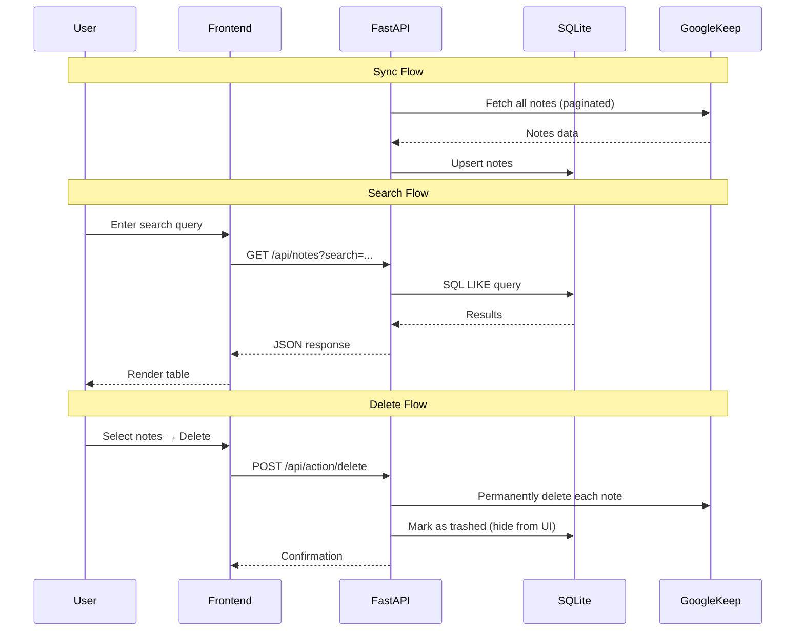

# 🗂️ Keep Manager

A local web application for managing Google Keep notes with powerful search, regex filtering, and bulk operations. Built with FastAPI and vanilla JavaScript.


---

## ✨ Features

- **🔄 Sync Notes** — Pull all Google Keep notes into a fast local SQLite cache
- **🔍 Smart Search** — Instant text search across titles and bodies
- **🧩 Regex Filtering** — Advanced pattern matching with saved filter presets
- **🗑️ Mass Delete** — Select multiple notes and delete them in bulk directly from Google Keep
- **👁️ Preview Pane** — Read-only split-pane view with quick-delete cycling
- **📋 Checklist Support** — Properly parses checklist notes (including nested items)
- **🌙 Dark Theme** — Modern dark UI with Inter font and violet accent colors

---

## 🏗️ Architecture



### Tech Stack

| Layer      | Technology                    |
|------------|-------------------------------|
| Backend    | Python, FastAPI, Uvicorn      |
| Database   | SQLite                        |
| Frontend   | HTML5, CSS3, Vanilla JS       |
| API        | Google Keep API v1            |
| Auth       | Service Account + Domain-Wide Delegation |

---

## 🚀 Getting Started

### Prerequisites

Before you begin, ensure you have:

- **Python 3.8+** installed on your system
- **Google Workspace account** (⚠️ Google Keep API is NOT available for personal Gmail accounts)
- Access to **Google Cloud Console** with admin privileges
- Domain admin access for **Google Workspace Admin Console** (required for domain-wide delegation)

> **Note**: This project requires a Google Workspace (formerly G Suite) account because the Google Keep API only works with Workspace accounts, not personal Gmail accounts.

---

## 📋 Step-by-Step Setup

### Step 1: Clone the Repository

```bash
git clone https://github.com/YOUR_USERNAME/keep-manager.git
cd keep-manager
```

### Step 2: Set Up Python Environment

```bash
# Create a virtual environment
python -m venv venv

# Activate the virtual environment
# Windows:
venv\Scripts\activate

# macOS/Linux:
source venv/bin/activate

# Install all dependencies from requirements.txt
pip install -r requirements.txt
```

> **Tip**: If you skip this step, `run.py` will detect missing dependencies and offer to install them automatically!

The `requirements.txt` includes:
- `fastapi` - Web framework
- `uvicorn` - ASGI server
- `google-auth` - Google authentication
- `google-api-python-client` - Google Keep API client
- `python-dotenv` - Environment variable management
- `pydantic` - Data validation

### Step 3: Google Cloud Setup

#### 3.1 Create a Google Cloud Project

1. Go to [Google Cloud Console](https://console.cloud.google.com/)
2. Click **"Select a project"** → **"New Project"**
3. Name it (e.g., "Keep Manager") and click **Create**

#### 3.2 Enable Google Keep API

1. In your project, go to **"APIs & Services"** → **"Library"**
2. Search for **"Google Keep API"**
3. Click on it and press **"Enable"**

#### 3.3 Create Service Account

1. Go to **"APIs & Services"** → **"Credentials"**
2. Click **"Create Credentials"** → **"Service Account"**
3. Enter a name (e.g., "keep-sync-service")
4. Click **"Create and Continue"**
5. Skip optional steps and click **"Done"**

#### 3.4 Create Service Account Key

1. Click on the service account you just created
2. Go to the **"Keys"** tab
3. Click **"Add Key"** → **"Create new key"**
4. Select **JSON** format
5. Click **"Create"** — this downloads `credentials.json`
6. **Move this file to your project root directory**

#### 3.5 Enable Domain-Wide Delegation

1. Still in the service account details page, click **"Edit"** (pencil icon)
2. Check **"Enable Google Workspace Domain-Wide Delegation"**
3. Click **"Save"**
4. Note the **Client ID** (you'll need this next)

#### 3.6 Configure Domain-Wide Delegation in Google Workspace Admin

1. Go to [Google Admin Console](https://admin.google.com/)
2. Navigate to **Security** → **Access and data control** → **API controls**
3. Scroll to **Domain-wide delegation**
4. Click **"Add new"** or **"Manage Domain-Wide Delegation"**
5. Enter the **Client ID** from step 3.5
6. Add OAuth scopes:
   ```
   https://www.googleapis.com/auth/keep
   https://www.googleapis.com/auth/keep.readonly
   ```
7. Click **"Authorize"**

> **Detailed Guide**: For step-by-step screenshots and troubleshooting, see [ai-docs/auth-setup.md](ai-docs/auth-setup.md)

### Step 4: Configure Environment Variables

1. Copy the template file:
   ```bash
   cp .env.template .env
   ```

2. Edit `.env` and set your Google Workspace email:
   ```
   KEEP_USER_EMAIL=your-email@yourdomain.com
   ```

   Replace `your-email@yourdomain.com` with your actual Google Workspace email address.

### Step 5: Verify Your Setup

Ensure you have these two files in your project root:
- ✅ `credentials.json` (service account key)
- ✅ `.env` (with your email address)

Both files are gitignored and should **never** be committed to version control.

### Step 6: Initialize the Database

```bash
python db.py
```

This creates `keep_cache.db` with the necessary tables.

### Step 7: Test Authentication

Test your Google Keep API connection:

```bash
python keep_client.py
```

If successful, you should see:
```
Authentication successful! Testing API call...
Found X notes. First few:
 - Note Title 1
 - Note Title 2
```

If you see errors, check:
- `credentials.json` is in the project root
- `.env` has the correct email address
- Domain-wide delegation is properly configured
- You're using a Google Workspace account (not personal Gmail)

### Step 8: Sync Your Notes

Pull all notes from Google Keep to your local database:

```bash
python sync.py
```

You should see:
```
Starting sync process...
Using email: your-email@yourdomain.com
Sync complete. Synced X notes.
```

### Step 9: Start the Web Server

```bash
uvicorn main:app --reload --host 0.0.0.0 --port 8000
```

The server will start on [http://localhost:8000](http://localhost:8000)

Open your browser and navigate to that URL to access the Keep Manager interface.

---

## 🚀 Automated Run Script (Recommended)

Instead of manually running each step, use the automated **run script** that validates your entire setup and starts the app:

```bash
python run.py
```

### What the Run Script Does

The `run.py` script performs comprehensive validation before starting the server:

1. ✅ **Python Version Check** - Ensures Python 3.8+
2. ✅ **Virtual Environment Check** - Warns if not activated (recommended)
3. 📦 **Auto-Install Dependencies** - Detects missing packages and offers to install from `requirements.txt`
4. ✅ **Dependency Verification** - Confirms all required packages are available
5. ✅ **Credentials Check** - Confirms `credentials.json` exists
6. ✅ **Environment Check** - Validates `.env` file and `KEEP_USER_EMAIL`
7. ✅ **Database Check** - Initializes database if needed
8. ✅ **API Connection Test** - Verifies Google Keep API works
9. 🔄 **Optional Sync** - Offers to sync notes before starting
10. 🌐 **Server Startup** - Launches the web application

### Example Output

```
============================================================
Keep Manager - Setup Validation & Launcher
============================================================

ℹ Checking Python version...
✓ Python 3.11.0 detected
ℹ Checking virtual environment...
✓ Virtual environment is activated
ℹ Checking requirements.txt...
✓ requirements.txt found
ℹ Core dependencies appear to be installed
ℹ Verifying all dependencies are available...
✓ FastAPI is available
✓ Uvicorn is available
✓ python-dotenv is available
✓ google-auth is available
✓ google-api-python-client is available
✓ pydantic is available
✓ All dependencies verified!
ℹ Checking Google Cloud credentials...
✓ credentials.json found
ℹ Checking environment configuration...
✓ .env file found
✓ KEEP_USER_EMAIL configured: user@domain.com
ℹ Checking database...
✓ Database exists
ℹ Testing Google Keep API connection...
✓ Google Keep API connection successful

============================================================
All Checks Passed!
============================================================

✓ Your Keep Manager setup is properly configured

Sync now? [y/N]: y
Synced 150 notes.

============================================================
Starting Keep Manager Web Server
============================================================

ℹ Server will start on: http://localhost:8000
ℹ Press Ctrl+C to stop the server
```

**First-time setup**: If dependencies are missing, the script will detect this and prompt:

```
ℹ Checking requirements.txt...
✓ requirements.txt found
⚠ Some dependencies appear to be missing
ℹ Found requirements.txt - we can install them automatically

Install dependencies from requirements.txt? [Y/n]: y

Installing dependencies from requirements.txt...
This may take a minute...
[pip installation output]
✓ Dependencies installed successfully!
```

### Benefits of Using run.py

- **Automated validation** - No more guessing if your setup is correct
- **Auto-install dependencies** - Detects missing packages and installs them for you
- **Clear error messages** - Tells you exactly what's missing or misconfigured
- **One command** - No need to remember multiple setup steps
- **First-time friendly** - Guides new users through any issues
- **Database auto-init** - Creates the database automatically if missing
- **API testing** - Verifies your Google Keep connection actually works
- **Optional sync** - Prompts you to sync notes before starting

---

## 🔄 Daily Usage

Once setup is complete, your typical workflow is:

### Quick Start (Recommended)

```bash
# Activate virtual environment
source venv/bin/activate  # macOS/Linux
# or
venv\Scripts\activate     # Windows

# Run the automated script (validates setup + starts server)
python run.py
```

### Manual Start (Alternative)

```bash
# 1. Activate virtual environment
source venv/bin/activate  # macOS/Linux
# or
venv\Scripts\activate     # Windows

# 2. (Optional) Sync latest notes from Google Keep
python sync.py

# 3. Start the web server
uvicorn main:app --reload --host 0.0.0.0 --port 8000
```

The web interface will automatically sync after bulk deletes, but you can manually run `sync.py` anytime to refresh your local cache.

---

## 🧪 Testing Individual Components

```bash
# Run full setup validation (recommended)
python run.py

# Test database connection
python db.py

# Test Google Keep authentication
python keep_client.py

# Test note syncing
python sync.py

# Run with a specific email (overrides .env)
python sync.py user@domain.com
```

The `run.py` script is the best way to verify your entire setup at once.

---

## 🛠️ Troubleshooting

### "No notes found" or Authentication Errors

1. **Check credentials.json location**: Must be in project root
2. **Verify .env file**: Run `cat .env` (Linux/macOS) or `type .env` (Windows)
3. **Confirm domain-wide delegation**:
   - Check Client ID matches in Admin Console
   - Verify scopes are exactly as shown above
   - Wait 5-10 minutes after configuration for changes to propagate
4. **Ensure Google Workspace account**: Personal Gmail will NOT work

### "Failed to initialize Keep Service"

- Check `credentials.json` is valid JSON (open in text editor)
- Verify the service account email in credentials.json
- Ensure `KEEP_USER_EMAIL` in `.env` matches a real Workspace user

### "Invalid regex" Errors

- Test your regex pattern in a tool like [regex101.com](https://regex101.com/) first
- Remember to escape special characters: `\d`, `\w`, `\.`, etc.

### Database Locked Errors

- Close any other programs accessing `keep_cache.db`
- Only run one instance of the sync or web server at a time

### Port 8000 Already in Use

```bash
# Use a different port
uvicorn main:app --reload --host 0.0.0.0 --port 8080
```

For more issues and solutions, see [ai-docs/known-issues.md](ai-docs/known-issues.md).

---

## ⚠️ Important Warnings

- **Deletions are PERMANENT**: The Google Keep API's `delete()` method permanently removes notes, it does NOT move them to trash. There is no undo. Always double-check before mass deleting.
- **Labels not supported**: The REST API does not expose labels/tags (see [ai-docs/known-issues.md](ai-docs/known-issues.md) ISSUE-002)
- **Read-only notes**: Notes cannot be edited via the API — only viewed and deleted
- **Workspace only**: Personal Gmail accounts cannot use this application

---

## 🎯 Usage Tips

- **Regex Power**: Use patterns like `\byoutube\.com\b` to find all notes with YouTube links
- **Save Filters**: Store frequently-used regex patterns for quick access
- **Bulk Operations**: Select multiple notes with checkboxes for mass deletion
- **Preview Cycling**: Delete a note from the preview pane to auto-cycle to the next note
- **Background Sync**: The app automatically syncs after deletions to keep cache fresh

---

## 📐 Project Structure

```
Keep Manager/
├── run.py               # 🚀 Automated setup validator & launcher (START HERE!)
├── main.py              # FastAPI app — routes and API endpoints
├── keep_client.py       # Google Keep API authentication
├── sync.py              # Note sync engine
├── db.py                # SQLite schema and connection
├── requirements.txt     # Python dependencies
├── .env.template        # Environment variable template
├── templates/
│   └── index.html       # Frontend HTML
├── static/
│   ├── app.js           # Frontend JavaScript
│   └── style.css        # Dark theme CSS
├── ai-docs/             # Detailed documentation (progressive disclosure)
│   ├── architecture.md  # System design and data flows
│   ├── api-reference.md # Our API endpoints documentation
│   ├── google-keep-api.md # Official Google Keep API reference
│   ├── database.md      # Database schema and queries
│   ├── frontend.md      # UI components and design system
│   ├── auth-setup.md    # Google API authentication guide
│   ├── known-issues.md  # Bug log and lessons learned
│   └── roadmap.md       # Feature roadmap
├── claude.md            # AI agent context and workflow
├── agents.md            # Agent entry point
└── README.md            # This file
```

---

## 🔌 API Overview

| Method | Endpoint              | Description                 |
|--------|-----------------------|-----------------------------|
| GET    | `/`                   | Serve the web frontend      |
| GET    | `/api/health`         | Health check                |
| GET    | `/api/notes`          | List/search/filter notes    |
| POST   | `/api/action/delete`  | Delete notes from Keep      |
| GET    | `/api/filters`        | List saved regex filters    |
| POST   | `/api/filters`        | Save a new regex filter     |

See [ai-docs/api-reference.md](ai-docs/api-reference.md) for full documentation.

---

## 📊 Data Flow



---

## 🔒 Security

- `credentials.json` and `.env` are **gitignored** — never commit secrets
- Service Account keys should be rotated periodically
- Domain-wide delegation should be scoped to only necessary APIs
- All user-provided content is HTML-escaped before rendering

---

## 📝 License

MIT License — see [LICENSE](LICENSE) for details.

---

## 🤝 Contributing

1. Fork the repository
2. Create a feature branch (`git checkout -b feature/my-feature`)
3. Commit changes (`git commit -m 'feat: add my feature'`)
4. Push to branch (`git push origin feature/my-feature`)
5. Open a Pull Request
