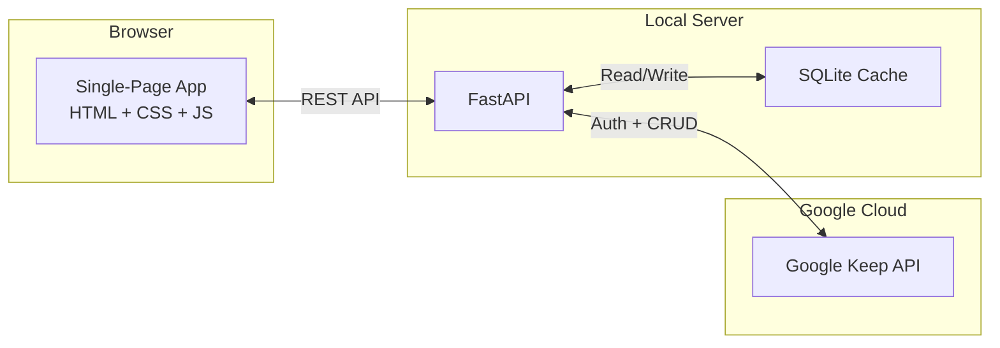
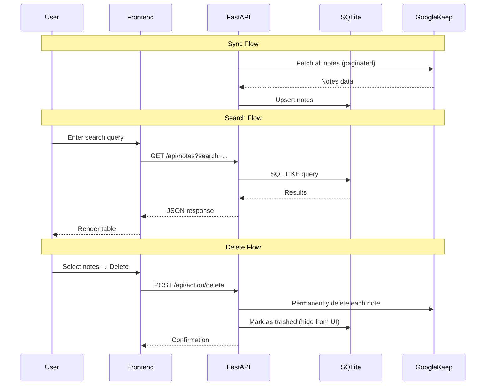

# 🗂️ Keep Manager

A local web application for managing Google Keep notes with powerful search, regex filtering, and bulk operations. Built with FastAPI and vanilla JavaScript.


---

## ✨ Features

- **🔄 Sync Notes** — Pull all Google Keep notes into a fast local SQLite cache
- **🔍 Smart Search** — Instant text search across titles and bodies
- **🧩 Regex Filtering** — Advanced pattern matching with saved filter presets
- **🗑️ Mass Delete** — Select multiple notes and delete them in bulk directly from Google Keep
- **👁️ Preview Pane** — Read-only split-pane view with quick-delete cycling
- **📋 Checklist Support** — Properly parses checklist notes (including nested items)
- **🌙 Dark Theme** — Modern dark UI with Inter font and violet accent colors

---

## 🏗️ Architecture



### Tech Stack

| Layer      | Technology                    |
|------------|-------------------------------|
| Backend    | Python, FastAPI, Uvicorn      |
| Database   | SQLite                        |
| Frontend   | HTML5, CSS3, Vanilla JS       |
| API        | Google Keep API v1            |
| Auth       | Service Account + Domain-Wide Delegation |

---

## 🚀 Getting Started

### Prerequisites

- **Python 3.8+**
- **Google Workspace account** (Google Keep API is not available for personal Gmail)
- **Google Cloud project** with Keep API enabled
- **Service Account** with domain-wide delegation

### Installation

```bash
# Clone the repository
git clone https://github.com/YOUR_USERNAME/keep-manager.git
cd keep-manager

# Create and activate virtual environment
python -m venv venv

# Windows
venv\Scripts\activate
# macOS/Linux
source venv/bin/activate

# Install dependencies
pip install fastapi uvicorn google-auth google-api-python-client python-dotenv
```

### Configuration

1. **Service Account Key**: Place your `credentials.json` in the project root
2. **Environment Variables**: Create a `.env` file:
   ```
   KEEP_USER_EMAIL=your-email@yourdomain.com
   ```
3. See [ai-docs/auth-setup.md](ai-docs/auth-setup.md) for detailed Google Cloud configuration

### Running

```bash
# Initialize the database
python db.py

# Sync notes from Google Keep
python sync.py

# Start the web server
uvicorn main:app --reload --host 0.0.0.0 --port 8000
```

Open [http://localhost:8000](http://localhost:8000) in your browser.

---

## 📐 Project Structure

```
Keep Manager/
├── main.py              # FastAPI app — routes and API endpoints
├── keep_client.py       # Google Keep API authentication
├── sync.py              # Note sync engine
├── db.py                # SQLite schema and connection
├── templates/
│   └── index.html       # Frontend HTML
├── static/
│   ├── app.js           # Frontend JavaScript
│   └── style.css        # Dark theme CSS
├── ai-docs/             # Detailed documentation (progressive disclosure)
│   ├── architecture.md  # System design and data flows
│   ├── api-reference.md # Our API endpoints documentation
│   ├── google-keep-api.md # Official Google Keep API reference
│   ├── database.md      # Database schema and queries
│   ├── frontend.md      # UI components and design system
│   ├── auth-setup.md    # Google API authentication guide
│   ├── known-issues.md  # Bug log and lessons learned
│   └── roadmap.md       # Feature roadmap
├── claude.md            # AI agent context and workflow
├── agents.md            # Agent entry point
└── README.md            # This file
```

---

## 🔌 API Overview

| Method | Endpoint              | Description                 |
|--------|-----------------------|-----------------------------|
| GET    | `/`                   | Serve the web frontend      |
| GET    | `/api/health`         | Health check                |
| GET    | `/api/notes`          | List/search/filter notes    |
| POST   | `/api/action/delete`  | Delete notes from Keep      |
| GET    | `/api/filters`        | List saved regex filters    |
| POST   | `/api/filters`        | Save a new regex filter     |

See [ai-docs/api-reference.md](ai-docs/api-reference.md) for full documentation.

---

## 📊 Data Flow



---

## 🔒 Security

- `credentials.json` and `.env` are **gitignored** — never commit secrets
- Service Account keys should be rotated periodically
- Domain-wide delegation should be scoped to only necessary APIs
- All user-provided content is HTML-escaped before rendering

---

## 📝 License

MIT License — see [LICENSE](LICENSE) for details.

---

## 🤝 Contributing

1. Fork the repository
2. Create a feature branch (`git checkout -b feature/my-feature`)
3. Commit changes (`git commit -m 'feat: add my feature'`)
4. Push to branch (`git push origin feature/my-feature`)
5. Open a Pull Request
