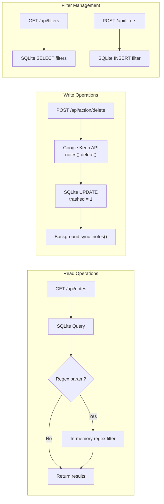

# API Reference — Keep Manager

## Base URL

```
http://localhost:8000
```

## Endpoints

### `GET /` — Serve Frontend
Returns the `templates/index.html` single-page application.

---

### `GET /api/health` — Health Check
**Response**: `200 OK`
```json
{ "status": "ok" }
```

---

### `GET /api/notes` — List Notes

Fetch notes from the local SQLite cache with optional search and regex filtering.

**Query Parameters**:
| Parameter | Type   | Required | Description                           |
|-----------|--------|----------|---------------------------------------|
| `search`  | string | No       | SQL LIKE search on title and body     |
| `regex`   | string | No       | Python regex filter (case-insensitive)|

**Response**: `200 OK`
```json
{
  "notes": [
    {
      "id": "notes/abc123",
      "title": "Shopping List",
      "snippet": "Milk, eggs, bread...",
      "body": "Milk\nEggs\nBread\nButter",
      "has_attachments": false
    }
  ]
}
```

**Error Response** (invalid regex): `400 Bad Request`
```json
{ "detail": "Invalid regular expression: ..." }
```

**Notes**:
- Only returns notes where `trashed = 0`
- `search` is applied at the SQL level via `LIKE`
- `regex` is applied in-memory after SQL results are fetched
- Both can be combined (SQL filters first, then regex narrows further)

---

### `POST /api/action/delete` — Queue Notes for Deletion

Queue one or more notes for background deletion via the Google Keep API.

**⚠️ CRITICAL**: This performs **PERMANENT deletion** from Google Keep (not move to trash). There is no undo.

**Background Processing**: Notes are queued and deleted asynchronously at a rate of ~72 deletions/minute to respect GCP quotas. The UI is immediately updated (optimistic), while actual deletion happens in the background.

**Request Body**:
```json
{
  "note_ids": ["notes/abc123", "notes/def456"]
}
```

**Response**: `200 OK`
```json
{
  "success": true,
  "queued": 2,
  "note_ids": ["notes/abc123", "notes/def456"],
  "message": "Queued 2 note(s) for deletion. Processing in background..."
}
```

**Error Response**: `500 Internal Server Error`
```json
{ "detail": "Failed to queue deletion. Check system logs." }
```

**Response Fields**:
| Field       | Type    | Description                                        |
|-------------|---------|----------------------------------------------------|
| `success`   | boolean | Always `true` if notes were queued successfully   |
| `queued`    | integer | Count of notes added to deletion queue            |
| `note_ids`  | array   | Note IDs that were queued for deletion            |
| `message`   | string  | User-facing status message                         |

**Behavior**:
1. **Immediate DB update**: Notes are marked `trashed = 1` in SQLite instantly
2. **Queue insertion**: Each note_id is added to `pending_deletes` table with status='pending'
3. **Background processing**: Worker thread processes queue at rate of 72 deletions/minute
4. **Rate limiting**: Enforced by background worker (not in this endpoint)
5. **Non-blocking**: Returns immediately, deletion happens asynchronously
6. **UI optimization**: Frontend reloads notes immediately (queued notes are already hidden)

**Important Notes**:
- ⚠️ **Deletion is asynchronous** — actual Google Keep deletion happens in background
- ⚠️ **Deletion is permanent** — no undo once processed
- ✅ **UI is non-blocking** — user can continue working immediately
- ✅ **Respects quotas** — background worker enforces 72 writes/minute limit (20% margin)
- Monitor deletion progress via `GET /api/queue/status`

---

### `GET /api/queue/status` — Get Deletion Queue Status

Get real-time status of the background deletion queue.

**Response**: `200 OK`
```json
{
  "queue_size": 15,
  "currently_processing": 1,
  "total_queued": 150,
  "total_processed": 134,
  "total_succeeded": 132,
  "total_failed": 2,
  "status_counts": {
    "pending": 14,
    "processing": 1,
    "completed": 132,
    "failed": 2
  },
  "recent_failures": [
    {
      "note_id": "notes/xyz789",
      "last_error": "HTTP 404: Note not found",
      "attempts": 3,
      "queued_at": "2026-03-04T10:30:00Z"
    }
  ],
  "processing": [
    {
      "note_id": "notes/abc123",
      "attempts": 1,
      "queued_at": "2026-03-04T10:32:15Z"
    }
  ],
  "worker_alive": true
}
```

**Response Fields**:
| Field                 | Type    | Description                                        |
|-----------------------|---------|----------------------------------------------------|
| `queue_size`          | integer | Number of notes waiting in memory queue           |
| `currently_processing`| integer | Number of notes being processed right now (0 or 1)|
| `total_queued`        | integer | Total notes queued since app start                |
| `total_processed`     | integer | Total notes processed (completed + failed)        |
| `total_succeeded`     | integer | Total successful deletions                         |
| `total_failed`        | integer | Total failed deletions                             |
| `status_counts`       | object  | Breakdown by status from database                  |
| `recent_failures`     | array   | Last 10 failed operations with error details      |
| `processing`          | array   | Currently processing note(s)                       |
| `worker_alive`        | boolean | Whether background worker thread is running        |

**Frontend Usage**:
- Poll this endpoint every 2-3 seconds while deletions are in progress
- Show queue status indicator when `queue_size + pending + processing > 0`
- Display errors from `recent_failures` to user
- Stop polling when queue is empty

---

### `GET /api/filters` — List Saved Filters

Fetch all saved regex filters.

**Response**: `200 OK`
```json
{
  "filters": [
    { "id": 1, "name": "YouTube Links", "regex": "\\byoutube\\.com\\b" }
  ]
}
```

---

### `POST /api/filters` — Save a Filter

Save a new named regex filter.

**Request Body**:
```json
{
  "name": "YouTube Links",
  "regex": "\\byoutube\\.com\\b"
}
```

**Response**: `200 OK`
```json
{
  "success": true,
  "id": 1,
  "name": "YouTube Links",
  "regex": "\\byoutube\\.com\\b"
}
```

---

## API Flow Diagram



## Pydantic Models

```python
class NoteModel(BaseModel):
    id: str
    title: str
    snippet: str
    body: str
    has_attachments: bool

class DeleteRequest(BaseModel):
    note_ids: List[str]

class FilterModel(BaseModel):
    name: str
    regex: str
```
