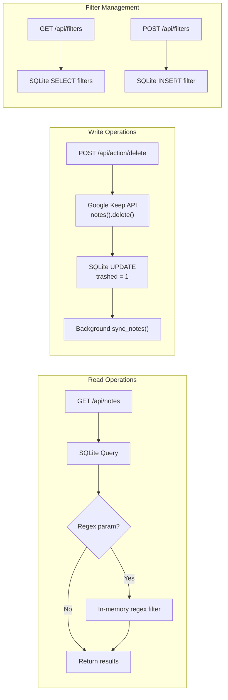

# API Reference — Keep Manager

## Base URL

```
http://localhost:8000
```

## Endpoints

### `GET /` — Serve Frontend
Returns the `templates/index.html` single-page application.

---

### `GET /api/health` — Health Check
**Response**: `200 OK`
```json
{ "status": "ok" }
```

---

### `GET /api/notes` — List Notes

Fetch notes from the local SQLite cache with optional search and regex filtering.

**Query Parameters**:
| Parameter | Type   | Required | Description                           |
|-----------|--------|----------|---------------------------------------|
| `search`  | string | No       | SQL LIKE search on title and body     |
| `regex`   | string | No       | Python regex filter (case-insensitive)|

**Response**: `200 OK`
```json
{
  "notes": [
    {
      "id": "notes/abc123",
      "title": "Shopping List",
      "snippet": "Milk, eggs, bread...",
      "body": "Milk\nEggs\nBread\nButter",
      "has_attachments": false
    }
  ]
}
```

**Error Response** (invalid regex): `400 Bad Request`
```json
{ "detail": "Invalid regular expression: ..." }
```

**Notes**:
- Only returns notes where `trashed = 0`
- `search` is applied at the SQL level via `LIKE`
- `regex` is applied in-memory after SQL results are fetched
- Both can be combined (SQL filters first, then regex narrows further)

---

### `POST /api/action/delete` — Delete Notes

Delete one or more notes via the Google Keep API and mark them as trashed locally.

**Request Body**:
```json
{
  "note_ids": ["notes/abc123", "notes/def456"]
}
```

**Response**: `200 OK`
```json
{
  "success": true,
  "deleted": 2,
  "ids": ["notes/abc123", "notes/def456"]
}
```

**Error Response**: `500 Internal Server Error`
```json
{ "detail": "Failed to initialize Keep Service. Check credentials." }
```

**Behavior**:
1. Iterates through each `note_id`
2. Calls `service.notes().delete(name=note_id)` on Google Keep API
3. Sets `trashed = 1` in local SQLite immediately
4. Queues a background sync task to reconcile local DB with remote state
5. Returns count and list of successfully deleted note IDs

---

### `GET /api/filters` — List Saved Filters

Fetch all saved regex filters.

**Response**: `200 OK`
```json
{
  "filters": [
    { "id": 1, "name": "YouTube Links", "regex": "\\byoutube\\.com\\b" }
  ]
}
```

---

### `POST /api/filters` — Save a Filter

Save a new named regex filter.

**Request Body**:
```json
{
  "name": "YouTube Links",
  "regex": "\\byoutube\\.com\\b"
}
```

**Response**: `200 OK`
```json
{
  "success": true,
  "id": 1,
  "name": "YouTube Links",
  "regex": "\\byoutube\\.com\\b"
}
```

---

## API Flow Diagram



## Pydantic Models

```python
class NoteModel(BaseModel):
    id: str
    title: str
    snippet: str
    body: str
    has_attachments: bool

class DeleteRequest(BaseModel):
    note_ids: List[str]

class FilterModel(BaseModel):
    name: str
    regex: str
```
