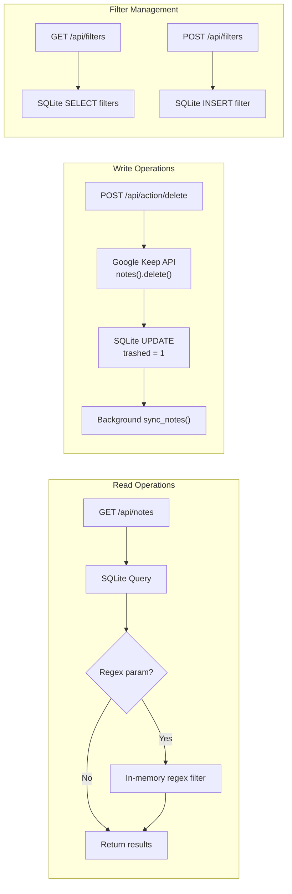

# API Reference — Keep Manager

## Base URL

```
http://localhost:8000
```

## Endpoints

### `GET /` — Serve Frontend
Returns the `templates/index.html` single-page application.

---

### `GET /api/health` — Health Check
**Response**: `200 OK`
```json
{ "status": "ok" }
```

---

### `GET /api/notes` — List Notes

Fetch notes from the local SQLite cache with optional search and regex filtering.

**Query Parameters**:
| Parameter | Type   | Required | Description                           |
|-----------|--------|----------|---------------------------------------|
| `search`  | string | No       | SQL LIKE search on title and body     |
| `regex`   | string | No       | Python regex filter (case-insensitive)|

**Response**: `200 OK`
```json
{
  "notes": [
    {
      "id": "notes/abc123",
      "title": "Shopping List",
      "snippet": "Milk, eggs, bread...",
      "body": "Milk\nEggs\nBread\nButter",
      "has_attachments": false
    }
  ]
}
```

**Error Response** (invalid regex): `400 Bad Request`
```json
{ "detail": "Invalid regular expression: ..." }
```

**Notes**:
- Only returns notes where `trashed = 0`
- `search` is applied at the SQL level via `LIKE`
- `regex` is applied in-memory after SQL results are fetched
- Both can be combined (SQL filters first, then regex narrows further)

---

### `POST /api/action/delete` — Delete Notes

Delete one or more notes via the Google Keep API and mark them as trashed locally.

**⚠️ CRITICAL**: This performs **PERMANENT deletion** from Google Keep (not move to trash). There is no undo.

**Request Body**:
```json
{
  "note_ids": ["notes/abc123", "notes/def456"]
}
```

**Successful Response**: `200 OK`
```json
{
  "success": true,
  "deleted": 2,
  "failed": 0,
  "success_ids": ["notes/abc123", "notes/def456"],
  "errors": [],
  "quota_exceeded": false,
  "warning": null
}
```

**Partial Failure Response**: `200 OK`
```json
{
  "success": true,
  "deleted": 1,
  "failed": 1,
  "success_ids": ["notes/abc123"],
  "errors": [
    {
      "note_id": "notes/def456",
      "error": "HTTP 404: Note not found"
    }
  ],
  "quota_exceeded": false,
  "warning": "1 note(s) failed to delete. Check error details."
}
```

**Quota Exceeded Response**: `200 OK`
```json
{
  "success": false,
  "deleted": 50,
  "failed": 50,
  "success_ids": ["notes/abc123", ...],
  "errors": [
    {
      "note_id": "notes/xyz789",
      "error": "Quota exceeded after 3 retries"
    },
    ...
  ],
  "quota_exceeded": true,
  "warning": "API quota limit reached. Some notes were not deleted. Please wait a few minutes and try again."
}
```

**Error Response**: `500 Internal Server Error`
```json
{ "detail": "Failed to initialize Keep Service. Check credentials and .env configuration." }
```

**Response Fields**:
| Field             | Type    | Description                                              |
|-------------------|---------|----------------------------------------------------------|
| `success`         | boolean | `true` if at least one note was deleted successfully    |
| `deleted`         | integer | Count of successfully deleted notes                      |
| `failed`          | integer | Count of notes that failed to delete                     |
| `success_ids`     | array   | Note IDs that were successfully deleted                  |
| `errors`          | array   | Array of `{note_id, error}` objects for failed deletions |
| `quota_exceeded`  | boolean | `true` if Google API quota limit was hit                 |
| `warning`         | string? | User-facing warning message (null if no warnings)        |

**Behavior**:
1. **Rate limiting**: Adds 50ms delay between requests (max 20 req/sec) to avoid quota limits
2. **Retry logic**: Each delete is retried up to 3 times with exponential backoff (1s, 2s, 4s)
3. **Error handling**:
   - **429 (Rate Limit)**: Retries with backoff
   - **403 with "quota"**: Stops batch, sets `quota_exceeded = true`
   - **404 (Not Found)**: Treats as success (note already deleted)
   - **403 (Permission)**: Returns clear permission error
   - **Other errors**: Returns HTTP error code and message
4. **Quota protection**: If quota is exceeded, remaining notes are marked as "Skipped due to quota limit"
5. **Local DB update**: Successfully deleted notes are marked `trashed = 1` in SQLite
6. **Background sync**: Queues background task to reconcile local DB with remote state
7. **Partial success**: Returns detailed breakdown of successes and failures

**Important Notes**:
- ⚠️ **No batch API exists** — notes are deleted individually in sequence
- Deletion is **permanent** and **irreversible** in Google Keep
- Large batches (100+ notes) may hit quota limits — recommend 50-100 notes at a time
- `success` field is `true` if *any* notes were deleted (partial success counts as success)
- Frontend displays detailed error modal for failures and quota issues

---

### `GET /api/filters` — List Saved Filters

Fetch all saved regex filters.

**Response**: `200 OK`
```json
{
  "filters": [
    { "id": 1, "name": "YouTube Links", "regex": "\\byoutube\\.com\\b" }
  ]
}
```

---

### `POST /api/filters` — Save a Filter

Save a new named regex filter.

**Request Body**:
```json
{
  "name": "YouTube Links",
  "regex": "\\byoutube\\.com\\b"
}
```

**Response**: `200 OK`
```json
{
  "success": true,
  "id": 1,
  "name": "YouTube Links",
  "regex": "\\byoutube\\.com\\b"
}
```

---

## API Flow Diagram



## Pydantic Models

```python
class NoteModel(BaseModel):
    id: str
    title: str
    snippet: str
    body: str
    has_attachments: bool

class DeleteRequest(BaseModel):
    note_ids: List[str]

class FilterModel(BaseModel):
    name: str
    regex: str
```
