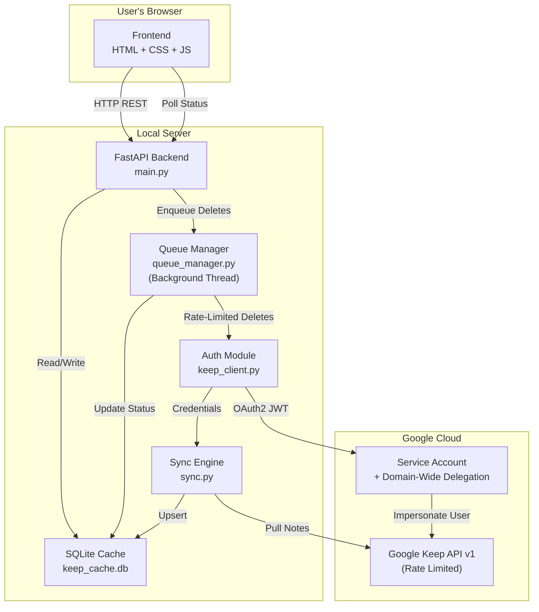
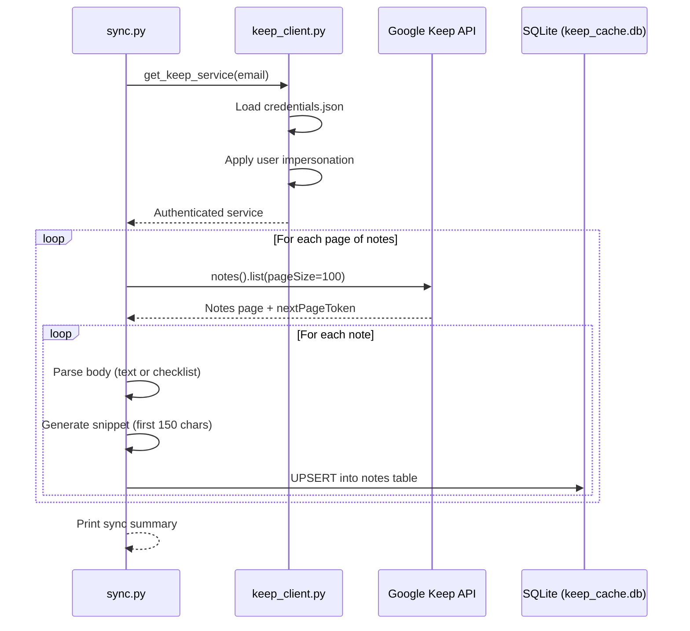
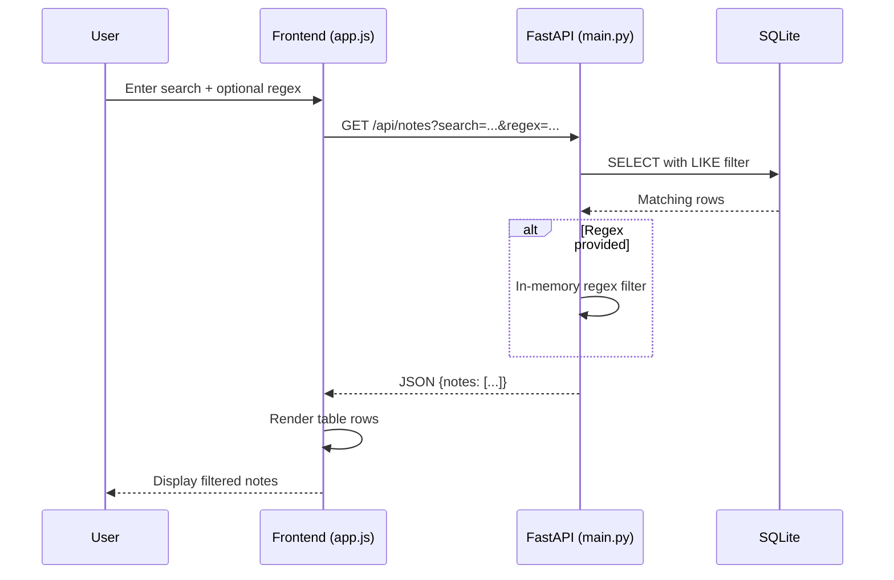
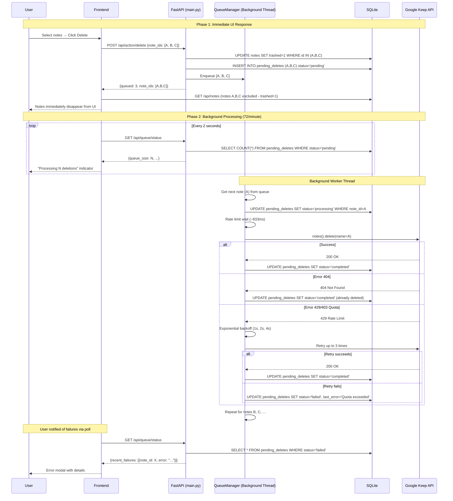

# Architecture — Keep Manager

## System Overview

Keep Manager is a local-first web application that caches Google Keep notes into a SQLite database for fast searching, filtering, and bulk management operations.



## Component Responsibilities

### `main.py` — FastAPI Application
- Serves the single-page frontend (`templates/index.html`)
- Mounts static files (`/static/`)
- Exposes REST API endpoints for notes and filters
- Handles mass-delete operations with background sync

### `keep_client.py` — Authentication Module
- Loads Google Service Account credentials from `credentials.json`
- Applies domain-wide delegation via user impersonation (`with_subject`)
- Returns an authenticated `googleapiclient` service object

### `sync.py` — Sync Engine
- Paginates through all notes via `service.notes().list()`
- Parses both text notes and checklist notes
- Upserts notes into the local SQLite database
- Handles attachment detection

### `db.py` — Database Layer
- Manages SQLite connection with `Row` factory for dict-like access
- Defines the schema: `notes`, `labels`, `note_labels`, `filters`
- Provides `init_db()` for first-time setup

### Frontend (`templates/` + `static/`)
- Single-page app with split-pane layout
- Left pane: searchable/filterable notes table with checkboxes
- Right pane: read-only note preview with inline delete
- Dark theme with Inter font and violet accent colors
- Polls `/api/queue/status` every 2 seconds during active deletions
- Shows queue status indicator in header

### `queue_manager.py` — Background Queue System ⭐ NEW

**Purpose**: Asynchronous deletion processing with rate limiting to respect GCP quotas.

**Components**:
1. **`RateLimiter`** class:
   - Token bucket implementation
   - Enforces 72 writes/minute (90/min with 20% safety margin)
   - Thread-safe with mutex lock
   - Calculates minimum interval between requests (~833ms)

2. **`QueueManager`** singleton class:
   - Manages an asyncio.Queue for pending deletions
   - Runs background worker thread (daemon)
   - Processes queue with rate limiting
   - Tracks statistics (queued, processed, succeeded, failed)
   - Updates `pending_deletes` table in database

**Worker Thread Flow**:
```
1. Get next note from queue (blocking, 1s timeout)
2. Update DB: status='processing'
3. Enforce rate limit (wait if needed)
4. Attempt deletion with retry logic (3 attempts, exponential backoff)
5. Update DB: status='completed' or 'failed'
6. Update statistics
7. Repeat until queue is empty
```

**Error Handling**:
- **404**: Treat as success (already deleted)
- **429/403 quota**: Exponential backoff (1s, 2s, 4s), then fail
- **403 permission**: Immediate failure with clear message
- **Other errors**: Immediate failure with error code/message

## Data Flow — Note Sync



## Data Flow — User Search



## Data Flow — Delete Notes (Queue-Based)



## Key Design Decisions

1. **Local-first caching** — Google Keep API is slow for searching; SQLite enables instant local queries
2. **Service Account auth** — avoids OAuth consent flow; requires Google Workspace domain
3. **Background queue for deletes** ⭐ — Respects GCP quotas (72 writes/min) while keeping UI responsive
4. **Optimistic UI updates** — Notes disappear immediately; actual deletion happens asynchronously
5. **Background sync after delete** — keeps local cache consistent without blocking the UI
6. **Vanilla frontend** — no build step, no dependencies, fast iteration
7. **Regex over SQL LIKE** — SQL LIKE handles basic search, Python regex handles advanced patterns in-memory
8. **Rate limiting with margin** — 20% safety margin (72 vs 90 req/min) prevents quota errors
9. **Thread-based queue** — Uses Python threading (not asyncio) for compatibility with sync API client
10. **Status polling** — Frontend polls queue status every 2 seconds for real-time progress

## GCP Quota Management

**Published Limits** (from GCP Console):
- 90 read requests/minute
- 90 write requests/minute (includes DELETE)
- 30 create requests/minute

**Our Implementation** (with 20% safety margin):
- Reads: 72/minute (unused - only used during sync)
- Writes: **72/minute = 1.2/second = ~833ms interval**
- Creates: 24/minute (unused - no create functionality)

**Rate Limiter Strategy**:
```python
min_interval = 60.0 / 72  # 0.833 seconds
# Enforced via token bucket in RateLimiter class
# Prevents bursting; guarantees safe spacing
```
