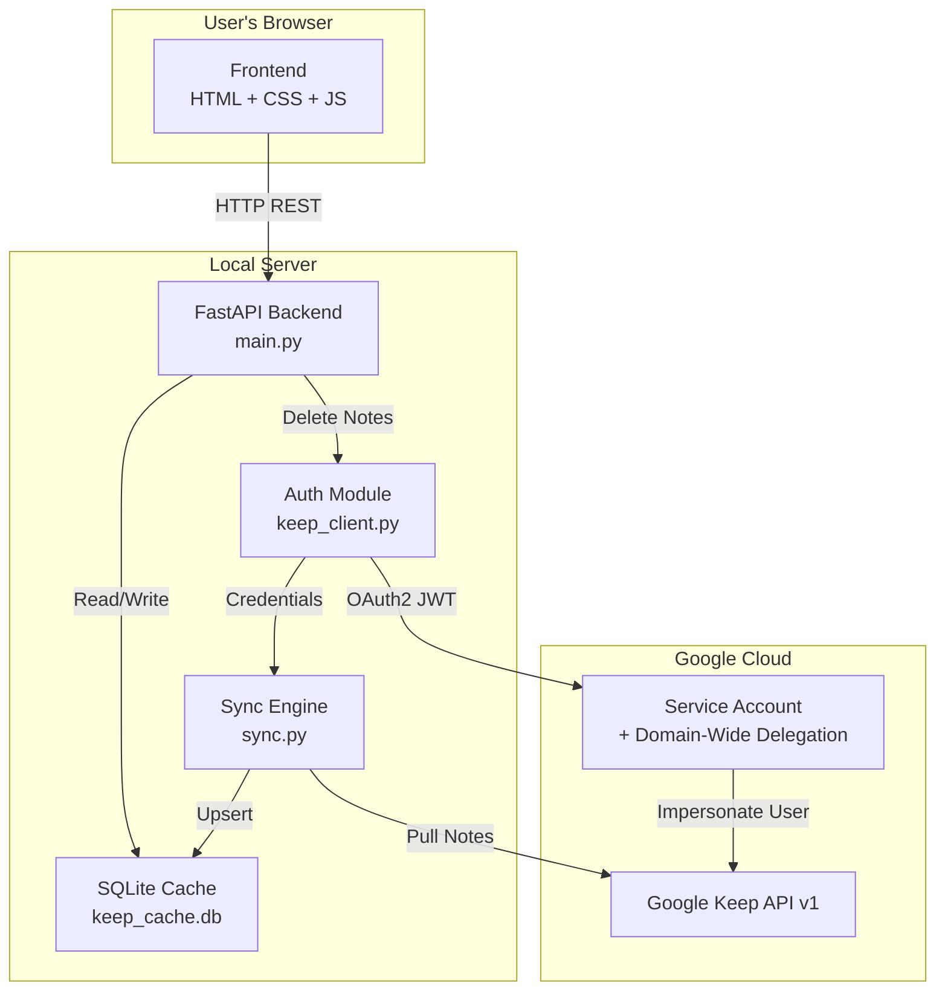
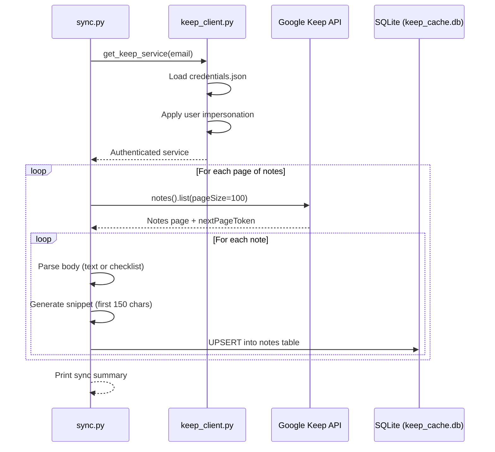
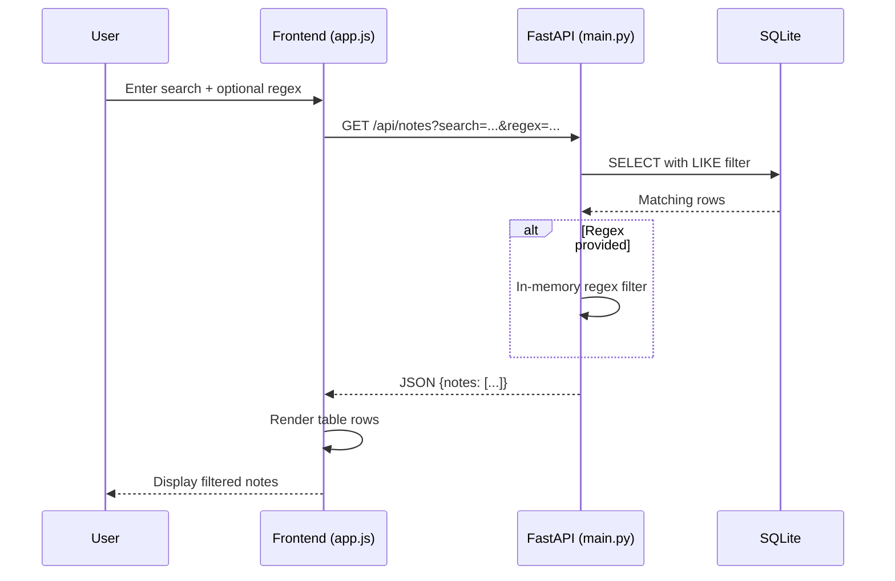
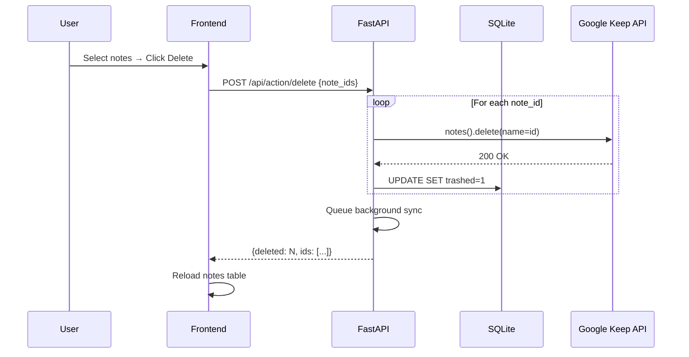

# Architecture — Keep Manager

## System Overview

Keep Manager is a local-first web application that caches Google Keep notes into a SQLite database for fast searching, filtering, and bulk management operations.

## Component Responsibilities

### `main.py` — FastAPI Application
- Serves the single-page frontend (`templates/index.html`)
- Mounts static files (`/static/`)
- Exposes REST API endpoints for notes and filters
- Handles mass-delete operations with background sync

### `keep_client.py` — Authentication Module
- Loads Google Service Account credentials from `credentials.json`
- Applies domain-wide delegation via user impersonation (`with_subject`)
- Returns an authenticated `googleapiclient` service object

### `sync.py` — Sync Engine
- Paginates through all notes via `service.notes().list()`
- Parses both text notes and checklist notes
- Upserts notes into the local SQLite database
- Handles attachment detection

### `db.py` — Database Layer
- Manages SQLite connection with `Row` factory for dict-like access
- Defines the schema: `notes`, `labels`, `note_labels`, `filters`
- Provides `init_db()` for first-time setup

### Frontend (`templates/` + `static/`)
- Single-page app with split-pane layout
- Left pane: searchable/filterable notes table with checkboxes
- Right pane: read-only note preview with inline delete
- Dark theme with Inter font and violet accent colors

## Data Flow — Note Sync

## Data Flow — User Search

## Data Flow — Delete Notes

## Key Design Decisions

1. **Local-first caching** — Google Keep API is slow for searching; SQLite enables instant local queries
2. **Service Account auth** — avoids OAuth consent flow; requires Google Workspace domain
3. **Background sync after delete** — keeps local cache consistent without blocking the UI
4. **Vanilla frontend** — no build step, no dependencies, fast iteration
5. **Regex over SQL LIKE** — SQL LIKE handles basic search, Python regex handles advanced patterns in-memory
