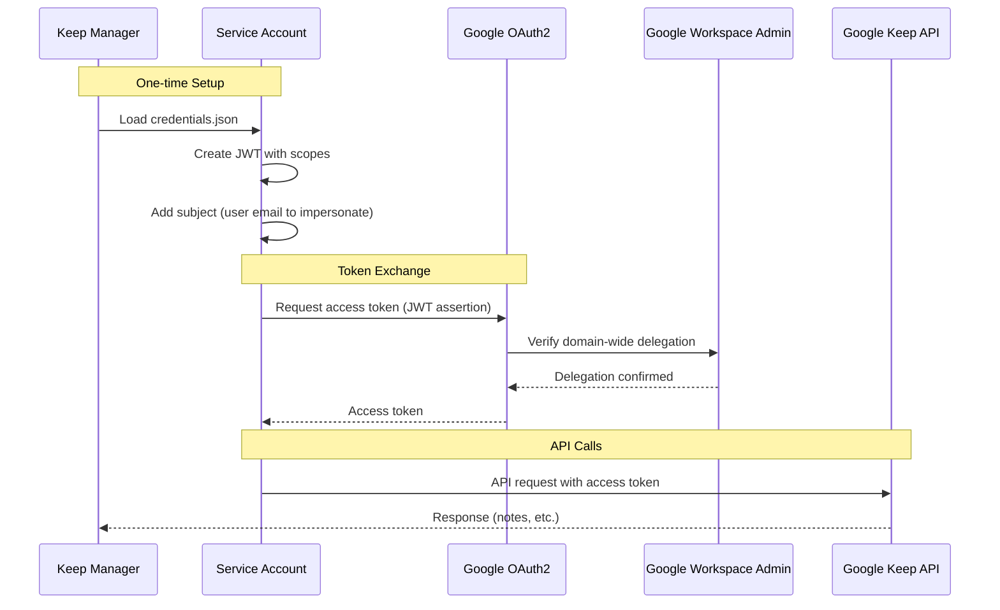

# Authentication Setup — Keep Manager

## Overview

Keep Manager authenticates with Google Keep API using a **Google Cloud Service Account** with **Domain-Wide Delegation**. This means:

1. You need a **Google Workspace** account (not personal Gmail)
2. A Service Account is created in Google Cloud Console
3. The Service Account is granted domain-wide delegation in Google Workspace Admin
4. The Service Account **impersonates** a specific user to access their Keep notes

> ⚠️ Google Keep API is **not available** for personal Gmail accounts. This app requires Google Workspace.

## Authentication Flow



## Setup Steps

### 1. Create a Google Cloud Project
1. Go to [Google Cloud Console](https://console.cloud.google.com/)
2. Create a new project or select an existing one
3. Enable the **Google Keep API** under APIs & Services

### 2. Create a Service Account
1. Navigate to **IAM & Admin → Service Accounts**
2. Click **Create Service Account**
3. Give it a name (e.g., `keep-manager-sa`)
4. Click **Create and Continue** (no roles needed)
5. Click **Done**

### 3. Generate a Key
1. Click on the newly created service account
2. Go to the **Keys** tab
3. Click **Add Key → Create new key → JSON**
4. Save the downloaded file as `credentials.json` in the project root

### 4. Enable Domain-Wide Delegation
1. On the service account details page, click **Show Advanced Settings**
2. Copy the **Client ID** (numeric)
3. Go to [Google Workspace Admin Console](https://admin.google.com/)
4. Navigate to **Security → API Controls → Domain-wide Delegation**
5. Click **Add New**
6. Paste the Client ID
7. Add these OAuth scopes:
   ```
   https://www.googleapis.com/auth/keep
   https://www.googleapis.com/auth/keep.readonly
   ```
8. Click **Authorize**

### 5. Configure Environment
Create a `.env` file in the project root:
```
KEEP_USER_EMAIL=your-email@yourdomain.com
```

## Files Involved

| File               | Purpose                                      |
|--------------------|----------------------------------------------|
| `credentials.json` | Service Account private key (gitignored!)     |
| `.env`             | Contains `KEEP_USER_EMAIL` (gitignored!)      |
| `keep_client.py`   | Loads creds, applies delegation, returns service |

## Code Reference

```python
# keep_client.py — Key auth logic
from google.oauth2 import service_account
from googleapiclient.discovery import build

SCOPES = [
    'https://www.googleapis.com/auth/keep',
    'https://www.googleapis.com/auth/keep.readonly'
]

creds = service_account.Credentials.from_service_account_file(
    'credentials.json', scopes=SCOPES
)
creds = creds.with_subject(user_email)  # Impersonate user
service = build('keep', 'v1', credentials=creds)
```

## Troubleshooting

| Problem                                 | Likely Cause                                     |
|-----------------------------------------|--------------------------------------------------|
| `403 Forbidden`                         | Domain-wide delegation not configured correctly  |
| `404 Not Found` on notes                | User email doesn't match a valid Workspace user  |
| `credentials.json not found`            | File missing from project root                   |
| `WARNING: user_email is not set`        | `.env` missing or `KEEP_USER_EMAIL` not set      |
| `Service account requires DWD`          | Scopes not authorized in Admin Console           |

## Security Notes

- **Never commit** `credentials.json` or `.env` — both are in `.gitignore`
- The service account key grants server-level access — treat it like a password
- Rotate keys periodically in Google Cloud Console
- Domain-wide delegation grants access to **any user's** Keep data in the domain — scope carefully
