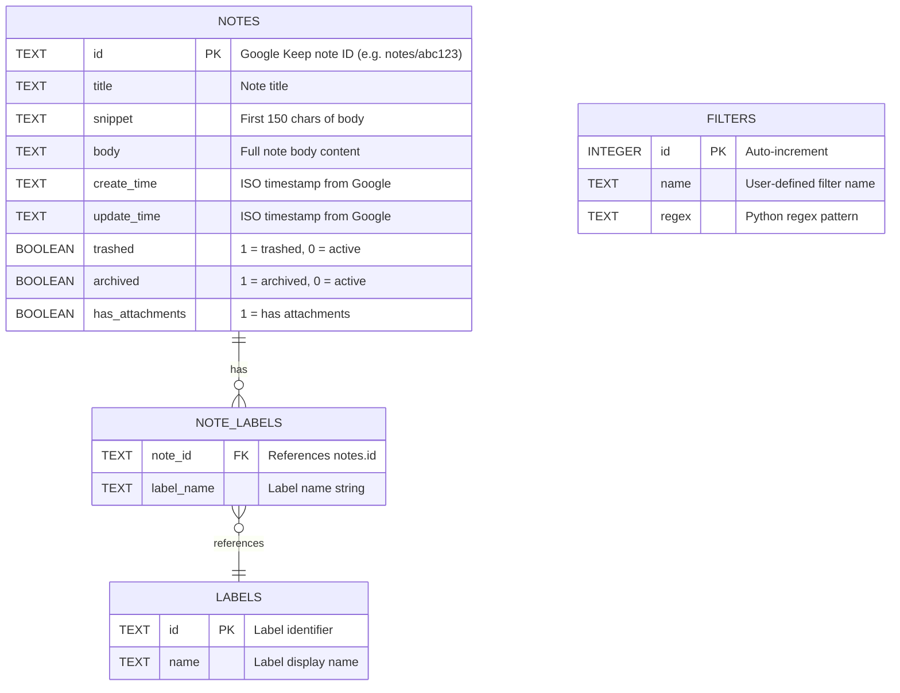

# Database Schema — Keep Manager

## Overview

The application uses **SQLite** as a local cache for Google Keep notes. The database file is `keep_cache.db` (gitignored). The schema is defined and initialized in `db.py`.

## Connection

```python
import sqlite3

DB_PATH = "keep_cache.db"

def get_db():
    conn = sqlite3.connect(DB_PATH)
    conn.row_factory = sqlite3.Row  # Enables dict-like row access
    return conn
```

## Entity-Relationship Diagram



## Tables

### `notes`
Primary storage for cached Google Keep notes.

| Column           | Type    | Constraints    | Description                          |
|------------------|---------|----------------|--------------------------------------|
| `id`             | TEXT    | PRIMARY KEY    | Google Keep note name (e.g. `notes/abc123`) |
| `title`          | TEXT    |                | Note title                           |
| `snippet`        | TEXT    |                | Truncated body (first 150 chars)     |
| `body`           | TEXT    |                | Full body content                    |
| `create_time`    | TEXT    |                | ISO 8601 timestamp from Google       |
| `update_time`    | TEXT    |                | ISO 8601 timestamp from Google       |
| `trashed`        | BOOLEAN |                | `0` = active, `1` = trashed          |
| `archived`       | BOOLEAN |                | `0` = active, `1` = archived         |
| `has_attachments`| BOOLEAN | DEFAULT 0      | `1` if note has attachments          |

### `labels`
Stores label metadata (currently populated during sync but not surfaced in UI).

| Column | Type | Constraints | Description        |
|--------|------|-------------|--------------------|
| `id`   | TEXT | PRIMARY KEY | Label identifier   |
| `name` | TEXT |             | Label display name |

### `note_labels`
Many-to-many mapping between notes and labels.

| Column       | Type | Constraints          | Description         |
|--------------|------|----------------------|---------------------|
| `note_id`    | TEXT | PK, FK → notes.id   | Note reference      |
| `label_name` | TEXT | PK                   | Label name string   |

### `filters`
User-defined saved regex filter patterns.

| Column | Type    | Constraints        | Description              |
|--------|---------|--------------------|--------------------------|
| `id`   | INTEGER | PK, AUTOINCREMENT  | Filter ID                |
| `name` | TEXT    |                    | User-defined filter name |
| `regex` | TEXT   |                    | Python regex pattern     |

## Key Queries

### Fetch active notes (with search)
```sql
SELECT id, title, snippet, body, has_attachments
FROM notes
WHERE trashed = 0 AND (title LIKE ? OR body LIKE ?)
```

### Fetch all active notes
```sql
SELECT id, title, snippet, body, has_attachments
FROM notes
WHERE trashed = 0
```

### Mark note as trashed
```sql
UPDATE notes SET trashed = 1 WHERE id = ?
```

### Upsert note (sync)
```sql
INSERT INTO notes (id, title, snippet, body, create_time, update_time, trashed, archived, has_attachments)
VALUES (?, ?, ?, ?, ?, ?, ?, ?, ?)
ON CONFLICT(id) DO UPDATE SET
    title=excluded.title,
    snippet=excluded.snippet,
    body=excluded.body,
    update_time=excluded.update_time,
    trashed=excluded.trashed,
    archived=excluded.archived,
    has_attachments=excluded.has_attachments
```

## Initialization

Run `python db.py` to create all tables. The script is idempotent (`CREATE TABLE IF NOT EXISTS`).
