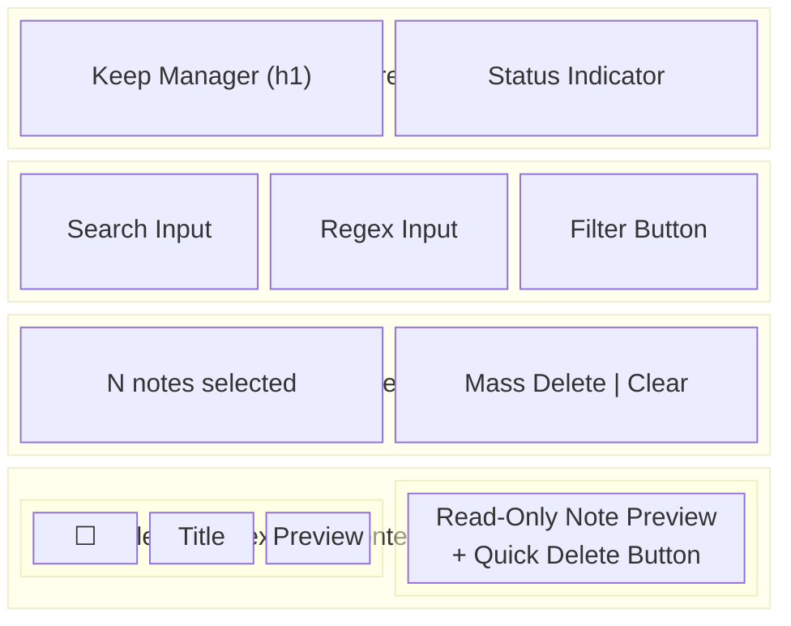
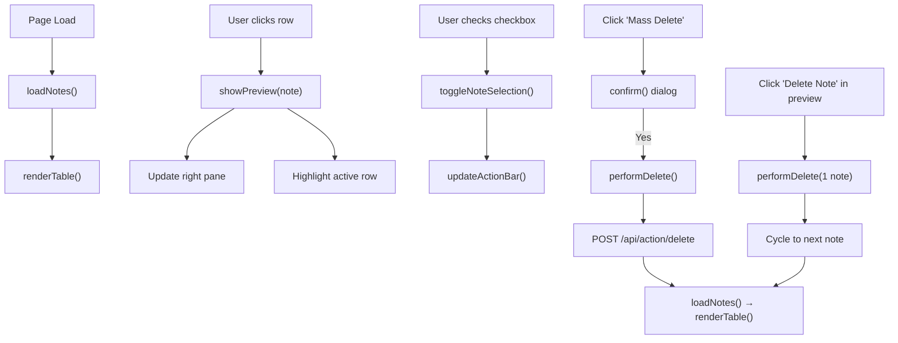

# Frontend — Keep Manager

## Overview

The frontend is a **single-page application** built with vanilla HTML, CSS, and JavaScript. No build tools, no frameworks — just static files served by FastAPI.

## File Locations

| File                    | Purpose                         |
|-------------------------|---------------------------------|
| `templates/index.html`  | Page structure and layout       |
| `static/style.css`      | Dark theme styling              |
| `static/app.js`         | All frontend logic              |

## UI Layout Wireframe



## Design System

### Color Palette (CSS Variables)

| Variable           | Value     | Usage                    |
|--------------------|-----------|--------------------------|
| `--bg-color`       | `#0f172a` | Page background          |
| `--card-bg`        | `#1e293b` | Cards, panels            |
| `--text-primary`   | `#f8fafc` | Main text                |
| `--text-secondary` | `#94a3b8` | Labels, secondary text   |
| `--accent`         | `#8b5cf6` | Buttons, highlights      |
| `--accent-hover`   | `#7c3aed` | Button hover states      |
| `--danger`         | `#ef4444` | Delete buttons           |
| `--danger-hover`   | `#dc2626` | Delete button hover      |
| `--border-color`   | `#334155` | Borders, dividers        |

### Typography
- **Font**: Inter (loaded from Google Fonts)
- **Fallback**: `system-ui, -apple-system, sans-serif`
- **H1**: Gradient text (`#a78bfa → #60a5fa`)

## JavaScript Architecture

### State Management
```javascript
let notes = [];                    // Current note list from API
let selectedNoteIds = new Set();   // Checked note IDs for mass operations
let activeNoteId = null;           // Currently previewed note
```

### Key Functions

| Function                      | Description                                    |
|-------------------------------|------------------------------------------------|
| `loadNotes()`                 | Fetches notes from API, applies search/regex   |
| `renderTable()`               | Renders the notes table from `notes` array     |
| `showPreview(note)`           | Populates the right preview pane               |
| `clearPreviewPane()`          | Resets preview to empty state                  |
| `performDelete(idSet, next)`  | Deletes notes via API, cycles to next note     |
| `toggleNoteSelection(id, on)` | Toggles checkbox selection state               |
| `updateTableSelectionVisuals()` | Syncs checkbox/row highlight state           |
| `updateActionBar()`           | Shows/hides action bar based on selection count|
| `escapeHTML(str)`             | XSS protection for rendered content            |

### Event Flow



## Responsive Considerations

- The layout uses `flex` with `flex: 2` (table) and `flex: 1` (preview)
- Container max-width: `1400px`
- Table area has independent `overflow-y: auto` scrolling
- Preview area has independent `overflow-y: auto` scrolling
- Header area is `position: sticky` at top

## Future UI Improvements (see roadmap)

- Label/tag filtering sidebar
- Note editing capability
- Pagination or virtual scrolling for large note sets
- Responsive mobile layout
- Keyboard navigation shortcuts
