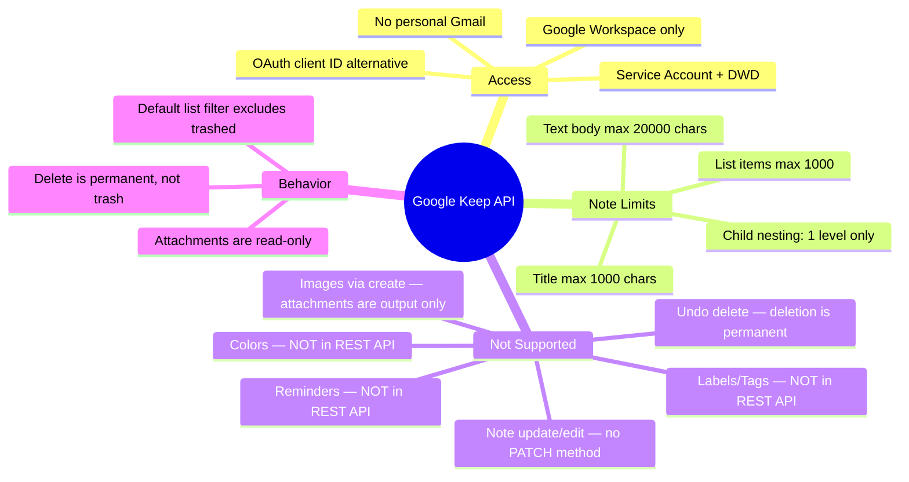

# Google Keep API — Official Reference

> **Source**: [Google Keep API Documentation](https://developers.google.com/workspace/keep/api/reference/rest)
> **Service**: `keep.googleapis.com`
> **Base URL**: `https://keep.googleapis.com`
> **Discovery Document**: `https://keep.googleapis.com/$discovery/rest?version=v1`
> **Last verified**: 2026-03-03

---

## API Overview

The Google Keep API is a RESTful API for **enterprise administrators** to manage Google Keep notes. It supports:
- Creating, listing, deleting notes
- Downloading note attachments
- Managing note permissions (sharing)

> ⚠️ **Important**: This API is designed for Google Workspace enterprise use with **domain-wide delegation**. It is NOT available for personal Gmail accounts.

---

## Resources

### Note Resource

The primary resource. Represents a single Google Keep note.

```json
{
  "name": "notes/abc123",           // Output only. Resource name / ID
  "createTime": "2024-01-15T...",   // Output only. Timestamp
  "updateTime": "2024-01-16T...",   // Output only. Timestamp
  "trashTime": "2024-01-17T...",    // Output only. Set only if trashed
  "trashed": false,                 // Output only. true = eventually deleted
  "attachments": [                  // Output only
    {
      "name": "notes/abc123/attachments/xyz",
      "mimeType": ["image/png"]
    }
  ],
  "permissions": [                  // Output only
    {
      "name": "notes/abc123/permissions/...",
      "role": "OWNER",
      "email": "user@domain.com",
      "deleted": false,
      "user": { "email": "user@domain.com" }
    }
  ],
  "title": "My Note",              // Max 1000 characters
  "body": {                         // Section object (union type)
    "text": {                       // TextContent — for text notes
      "text": "Note content here"   // Max 20,000 characters
    }
    // OR
    "list": {                       // ListContent — for checklist notes
      "listItems": [
        {
          "text": { "text": "Item 1" },  // Max 1000 chars per item
          "checked": false,
          "childListItems": [             // One level of nesting only
            {
              "text": { "text": "Sub-item" },
              "checked": true
            }
          ]
        }
      ]
    }
  }
}
```

#### Key Facts About the Note Resource
- `name` is the resource ID, format: `notes/{note_id}`
- `trashed` is **output only** — you cannot set it via the API
- `body` is a **Section** with a union field: either `text` (TextContent) or `list` (ListContent), never both
- Attachments are output only — cannot be created via the API
- Permissions include at least one entry (the owner)
- Max 1,000 list items per note
- One level of nesting for child list items

### Attachment Resource

```json
{
  "name": "notes/abc123/attachments/xyz",
  "mimeType": ["image/png", "image/jpeg"]
}
```

### Permission Resource

```json
{
  "name": "notes/abc123/permissions/...",
  "role": "OWNER | WRITER | ROLE_UNSPECIFIED",
  "email": "user@domain.com",
  "deleted": false,
  "user": { "email": "..." },    // OR
  "group": { "email": "..." },   // OR
  "family": {}                    // (no fields)
}
```

**Roles**: `ROLE_UNSPECIFIED`, `OWNER`, `WRITER`

---

## Methods

### `notes.create` — Create a Note

```
POST https://keep.googleapis.com/v1/notes
```

- **Request Body**: A `Note` object (provide `title` and `body`)
- **Response**: The created `Note` with server-populated fields
- **Scope**: `https://www.googleapis.com/auth/keep`

```python
# Python example
note = {
    "title": "My Note",
    "body": {
        "text": {
            "text": "Note content"
        }
    }
}
result = service.notes().create(body=note).execute()
```

---

### `notes.delete` — Delete a Note

```
DELETE https://keep.googleapis.com/v1/{name=notes/*}
```

- **Path parameter**: `name` (required) — the note resource name
- **Request Body**: Must be empty
- **Response**: Empty JSON object `{}`
- **Scope**: `https://www.googleapis.com/auth/keep`

> ⚠️ **CRITICAL**: This is a **permanent deletion**, NOT a "move to trash" operation. The note is irrecoverably deleted from Google Keep. There is no "undelete" or "restore from trash" API method.

```python
# Python example
service.notes().delete(name="notes/abc123").execute()
```

---

### `notes.get` — Get a Single Note

```
GET https://keep.googleapis.com/v1/{name=notes/*}
```

- **Path parameter**: `name` (required) — the note resource name
- **Request Body**: Must be empty
- **Response**: A `Note` object
- **Scopes**: `keep` or `keep.readonly`

```python
# Python example
note = service.notes().get(name="notes/abc123").execute()
```

---

### `notes.list` — List Notes

```
GET https://keep.googleapis.com/v1/notes
```

- **Query parameters**:
  | Parameter   | Type    | Description                                    |
  |-------------|---------|------------------------------------------------|
  | `pageSize`  | integer | Max results to return                          |
  | `pageToken` | string  | Token from previous page's `nextPageToken`     |
  | `filter`    | string  | Filter expression (see below)                  |

- **Response**: `{ "notes": [...], "nextPageToken": "..." }`
- **Scopes**: `keep` or `keep.readonly`

#### Filter Parameter

> ⚠️ **IMPORTANT**: If no filter is supplied, **the `trashed` filter is applied by default**. This means unfiltered `list()` calls will **only return non-trashed notes**.

Valid filter fields:
- `createTime` — When the note was created
- `updateTime` — When the note was last modified
- `trashTime` — When the note was trashed
- `trashed` — Whether the note is trashed

Filter syntax follows the [Google AIP-160 filtering spec](https://aip.dev/160).

```python
# List only non-trashed notes (default behavior)
results = service.notes().list(pageSize=100).execute()

# Explicitly include trashed notes
results = service.notes().list(pageSize=100, filter="trashed = true").execute()
```

---

### `media.download` — Download Attachment

```
GET https://keep.googleapis.com/v1/{name=notes/*/attachments/*}
```

- **Path parameter**: `name` (required) — attachment resource name
- **Query parameter**: `mimeType` (required) — the IANA MIME type to download
- **Response**: The attachment file content
- **Scopes**: `keep` or `keep.readonly`

---

### `notes.permissions.batchCreate` — Share a Note

```
POST https://keep.googleapis.com/v1/{parent=notes/*}/permissions:batchCreate
```

- **Path parameter**: `parent` — the note resource name
- **Request Body**: `{ "requests": [{ "parent": "notes/...", "permission": {...} }] }`
- **Response**: `{ "permissions": [...] }`
- **Scope**: `https://www.googleapis.com/auth/keep`

---

### `notes.permissions.batchDelete` — Remove Sharing

```
POST https://keep.googleapis.com/v1/{parent=notes/*}/permissions:batchDelete
```

- **Path parameter**: `parent` — the note resource name
- **Scope**: `https://www.googleapis.com/auth/keep`

---

## OAuth Scopes

| Scope                                          | Access Level  | Required For                    |
|------------------------------------------------|---------------|---------------------------------|
| `https://www.googleapis.com/auth/keep`         | Read + Write  | create, delete, permissions     |
| `https://www.googleapis.com/auth/keep.readonly`| Read Only     | get, list, media.download       |

---

## API Limitations & Constraints



### What the API Does NOT Support
1. **Labels/Tags** — Not exposed in the REST API (only in the mobile app)
2. **Note colors** — Not available via API
3. **Reminders** — Not available via API
4. **Note editing/updating** — There is **no PATCH or PUT** method for notes
5. **Creating attachments** — Attachments are output-only (read/download only)
6. **Undo delete** — Delete is permanent; no restore endpoint
7. **Archive/unarchive** — Not available via API

---

## Relationship to Our Codebase

```mermaid
graph LR
    subgraph "Our Code"
        KC["keep_client.py"] --> |"builds service"| SVC["Authenticated Service"]
        SYNC["sync.py"] --> |"uses"| SVC
        MAIN["main.py"] --> |"uses"| SVC
    end

    subgraph "API Methods Used"
        SYNC --> |"notes().list()"| LIST["notes.list"]
        MAIN --> |"notes().delete()"| DEL["notes.delete"]
    end

    subgraph "API Methods Available but Unused"
        CREATE["notes.create"]
        GET["notes.get"]
        MEDIA["media.download"]
        PERMS["permissions.batchCreate/Delete"]
    end

    style CREATE fill:#444,stroke:#666
    style GET fill:#444,stroke:#666
    style MEDIA fill:#444,stroke:#666
    style PERMS fill:#444,stroke:#666
```



| API Method              | Used In           | Status      |
|-------------------------|-------------------|-------------|
| `notes.list`            | `sync.py`         | ✅ Active   |
| `notes.delete`          | `main.py`         | ✅ Active   |
| `notes.create`          | —                 | 🔲 Not used |
| `notes.get`             | —                 | 🔲 Not used |
| `media.download`        | —                 | 🔲 Not used |
| `permissions.batchCreate` | —               | 🔲 Not used |
| `permissions.batchDelete` | —               | 🔲 Not used |
