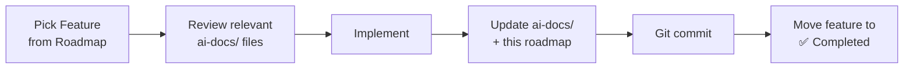

# Roadmap — Keep Manager

## Current Status

The application has a functional MVP with the following completed features:

### ✅ Completed
- [x] FastAPI backend with REST API
- [x] Google Keep API authentication via Service Account
- [x] Full note sync to local SQLite cache
- [x] Text note and checklist note parsing
- [x] Search notes by title or body (SQL LIKE)
- [x] Regex filtering (in-memory, case-insensitive)
- [x] Mass delete with Google Keep API integration
- [x] Single note quick-delete with auto-cycling to next note
- [x] Read-only note preview pane
- [x] Saved regex filter management
- [x] Dark theme UI with Inter font
- [x] Background sync after delete operations

---

## 🗺️ Planned Features

### Phase 1 — Core Improvements
| Feature                        | Priority | Complexity | Description                                        |
|--------------------------------|----------|------------|----------------------------------------------------|
| Label/Tag filtering            | High     | Medium     | Filter notes by Google Keep labels                 |
| Auto-sync on startup           | High     | Low        | Trigger `sync_notes()` when server starts          |
| Pagination / Virtual scrolling | Medium   | Medium     | Handle large note sets without browser lag          |
| Note count badge               | Low      | Low        | Show total/filtered note count prominently          |

### Phase 2 — Enhanced UI
| Feature                       | Priority | Complexity | Description                                         |
|-------------------------------|----------|------------|-----------------------------------------------------|
| Responsive mobile layout      | Medium   | Medium     | Stack table + preview vertically on small screens   |
| Keyboard navigation           | Medium   | Medium     | Arrow keys to navigate notes, Enter to preview      |
| Sort by date/title            | Medium   | Low        | Column header click to sort                         |
| Note editing                  | Low      | High       | Edit notes and push changes back to Google Keep     |

### Phase 3 — Advanced Features
| Feature                      | Priority | Complexity | Description                                          |
|------------------------------|----------|------------|------------------------------------------------------|
| Scheduled auto-sync          | Medium   | Medium     | Periodic background sync (e.g., every 5 minutes)    |
| Export filtered notes        | Medium   | Medium     | Export search results as CSV/JSON                    |
| Attachment preview           | Low      | High       | Display images/files attached to notes               |
| Multi-user support           | Low      | High       | Manage notes for multiple Workspace users            |

---

## Development Workflow

When picking up a feature from this roadmap:

1. Select a feature from the tables above
2. Review only the relevant `ai-docs/` files (progressive disclosure)
3. Implement the feature
4. Update the relevant docs to reflect changes
5. Move the feature to the **Completed** section
6. Git commit with a descriptive message
