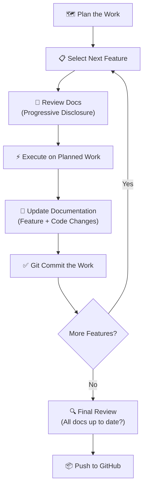

# Claude.md — Keep Manager AI Agent Context

> **Purpose**: This file is the central reference and instruction set for any AI agent working on this project.
> It follows a progressive disclosure model — only load detailed docs from `ai-docs/` when needed for a specific task.

---

## 🏗️ Project Overview

**Keep Manager** is a local web application for managing Google Keep notes. It uses a **FastAPI** backend with a **SQLite** cache and a vanilla HTML/CSS/JS frontend. Notes are synced from Google Keep via the official REST API using a Google Service Account with domain-wide delegation.

### Key Capabilities
- Sync Google Keep notes to a local SQLite database
- Search and regex-filter notes
- Mass-delete notes (with live Google Keep API deletion)
- Read-only note preview pane with quick delete
- Saved regex filters

---

## 📁 Project Structure

```
Keep Manager/
├── run.py               # 🚀 Automated setup validator & launcher
├── main.py              # FastAPI app — routes, API endpoints
├── keep_client.py       # Google Keep API service account auth
├── sync.py              # Sync engine — pulls notes to SQLite
├── db.py                # SQLite database schema & connection
├── requirements.txt     # Python dependencies
├── .env.template        # Environment variable template
├── templates/
│   └── index.html       # Single-page frontend
├── static/
│   ├── app.js           # Frontend logic (vanilla JS)
│   └── style.css        # Dark theme styling
├── credentials.json     # Service account key (gitignored)
├── .env                 # Environment variables (gitignored)
├── .gitignore           # Python + project-specific ignores
├── claude.md            # THIS FILE — AI agent primary context
├── agents.md            # Agent entry point — points here
├── README.md            # Human-facing project documentation
└── ai-docs/               # Progressive disclosure documentation
    ├── architecture.md    # System architecture & data flow
    ├── api-reference.md   # Our API endpoints documentation
    ├── google-keep-api.md # Official Google Keep API reference
    ├── database.md        # Database schema & queries
    ├── frontend.md        # Frontend components & UI patterns
    ├── auth-setup.md      # Google API auth & credentials setup
    ├── known-issues.md    # Bug log & lessons learned
    └── roadmap.md         # Feature roadmap & planned work
```

---

## 🔧 Tech Stack

| Layer      | Technology                          |
|------------|-------------------------------------|
| Backend    | Python 3.x, FastAPI, Uvicorn        |
| Database   | SQLite (local cache)                |
| Frontend   | HTML5, Vanilla CSS, Vanilla JS      |
| API        | Google Keep API v1 (REST)           |
| Auth       | Google Service Account + Domain-Wide Delegation |
| Font       | Inter (Google Fonts)                |

---

## 📚 Progressive Disclosure — AI Documentation Index

When working on a feature, **only load the docs you need**. Each file in `ai-docs/` covers a focused topic.

| Need                              | Load This Doc                   |
|-----------------------------------|---------------------------------|
| Understanding system design       | `ai-docs/architecture.md`      |
| Working on our API endpoints      | `ai-docs/api-reference.md`     |
| Google Keep API capabilities      | `ai-docs/google-keep-api.md`   |
| Modifying database schema         | `ai-docs/database.md`          |
| Changing UI/frontend behavior     | `ai-docs/frontend.md`          |
| Setting up or debugging auth      | `ai-docs/auth-setup.md`        |
| Debugging or reviewing past bugs  | `ai-docs/known-issues.md`      |
| Planning next features            | `ai-docs/roadmap.md`           |

> **Rule**: Do NOT load all docs at once. Use the table above to identify which doc is relevant to the current task.

---

## 🔄 Development Workflow

Follow this workflow for all development work on this project:



### Workflow Steps (Detailed)

1. **Plan the Work**
   - Define what features or fixes are needed
   - Break down into discrete, committable units
   - Document the plan in `ai-docs/roadmap.md`

2. **For Each Feature:**
   - **Review Documentation** — Use progressive disclosure. Only load the `ai-docs/` file(s) relevant to the feature. Don't load everything.
   - **Execute on Planned Work** — Implement the feature, following patterns established in the codebase.
   - **Update Documentation** — Update the relevant `ai-docs/` file(s) to reflect changes. Update this file (`claude.md`) if the project structure changes.
   - **Git Commit** — Commit with a clear, descriptive message following conventional commits: `feat:`, `fix:`, `docs:`, `refactor:`, etc.

3. **Final Review**
   - Ensure all documentation is fully up to date
   - Verify no broken references in this index
   - Push to GitHub

---

## 📊 Mermaid Diagrams

**Use Mermaid diagrams** wherever they help explain:
- **Architecture** — system design, component relationships
- **Data Flow** — how data moves between services, API, DB, and frontend
- **UI Wireframes** — layout structure using block diagrams
- **Workflows** — processes, user flows, CI/CD pipelines
- **Database** — ER diagrams for schema visualization

Mermaid is preferred because:
- It's **version-controllable** (plain text in markdown)
- It's **readable by both humans and AI**
- It renders natively in GitHub, VSCode, and most markdown viewers

### Example Usage
```markdown
## Data Flow Diagram
​```mermaid
sequenceDiagram
    participant User
    participant Frontend
    participant FastAPI
    participant SQLite
    participant GoogleKeepAPI

    User->>Frontend: Search / Filter
    Frontend->>FastAPI: GET /api/notes?search=...
    FastAPI->>SQLite: SELECT * FROM notes WHERE ...
    SQLite-->>FastAPI: Results
    FastAPI-->>Frontend: JSON Response
    Frontend-->>User: Render Table
​```
```

---

## ⚙️ Running the Project

### Quick Start (Recommended)

```bash
# 1. Activate virtual environment
# Windows:
venv\Scripts\activate
# macOS/Linux:
source venv/bin/activate

# 2. Run the automated launcher (validates setup + starts server)
python run.py
```

The `run.py` script automatically:
- Validates Python version, dependencies, credentials, and .env configuration
- Checks/initializes the database
- Tests Google Keep API connection
- Offers to sync notes
- Starts the web server on http://localhost:8000

### Manual Start (Alternative)

```bash
# 1. Activate virtual environment
# Windows:
venv\Scripts\activate
# macOS/Linux:
source venv/bin/activate

# 2. Set environment variables
# Ensure .env contains KEEP_USER_EMAIL=your-email@domain.com

# 3. Initialize the database (if needed)
python db.py

# 4. Sync notes from Google Keep
python sync.py

# 5. Start the web server
uvicorn main:app --reload --host 0.0.0.0 --port 8000
```

---

## 🚨 Important Notes

- **Never commit** `credentials.json`, `.env`, or `*.db` files
- The Google Keep API requires **Google Workspace** (not personal Gmail)
- Service accounts need **domain-wide delegation** enabled in Google Admin Console
- The frontend is a **single-page app** — all routing is client-side via API calls
- The database is a **cache** — Google Keep is the source of truth
- **`notes.delete()` is PERMANENT** — not a "move to trash" (see `ai-docs/known-issues.md` ISSUE-001)
- **Labels are NOT available** in the REST API (see `ai-docs/known-issues.md` ISSUE-002)
- **Notes cannot be edited** via the API — no PATCH/PUT method exists (see `ai-docs/known-issues.md` ISSUE-005)
- Always check `ai-docs/known-issues.md` before implementing features to avoid repeating past mistakes
